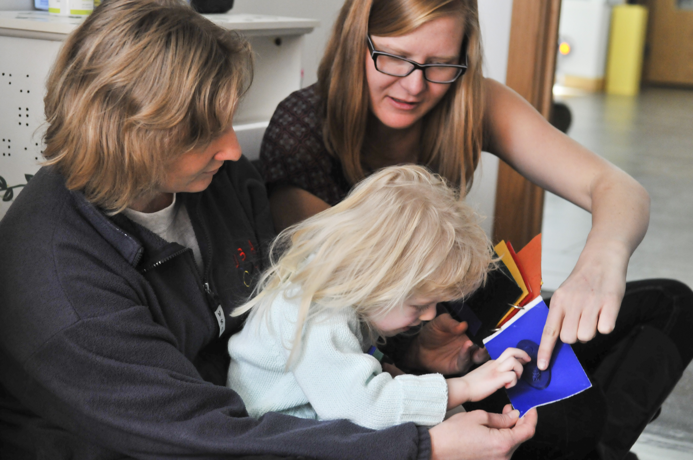
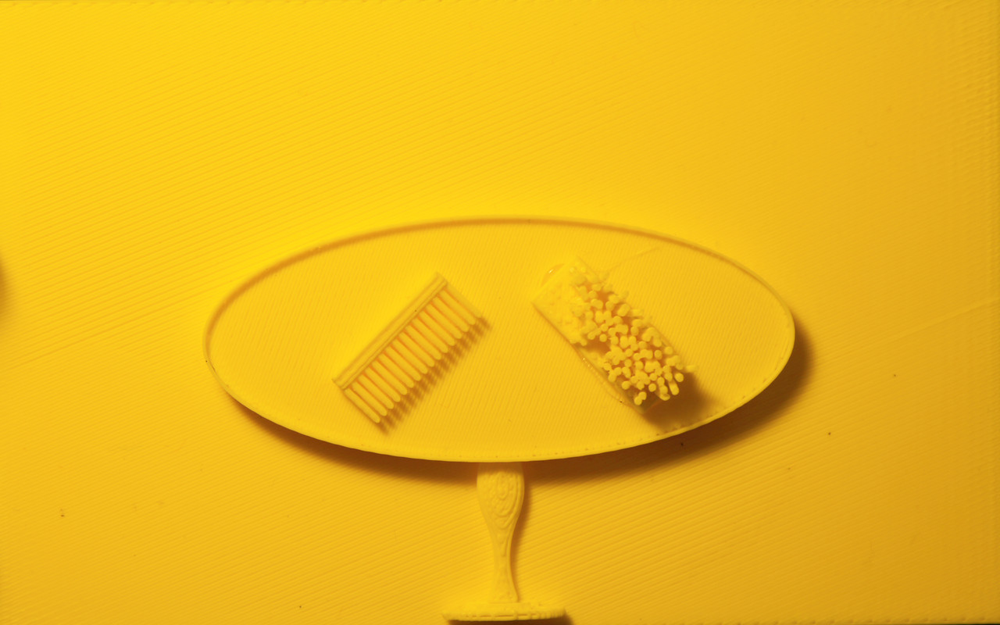
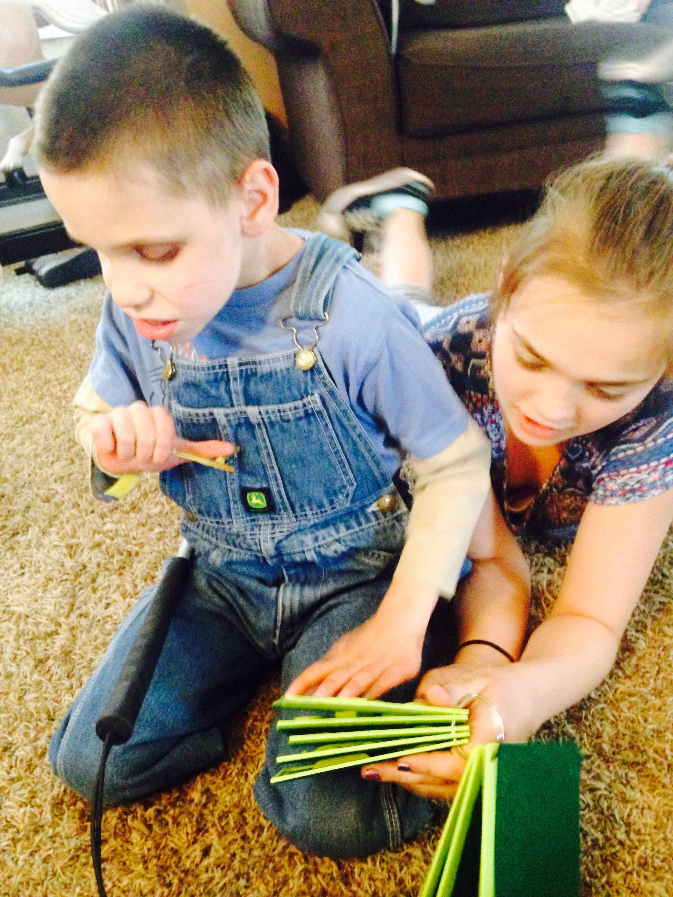

```craftml
<col spacing="5">
  <h1>Printing</h1>
  <h2>Pictures</h2>
  <h3>in</h3>
  <div t="scale 2 2 10;
          rotate x 90">
    3D
  </div>
</col>
```

Tom Yeh, University of Colorado Boulder | DUB Seminar

---

## Goodnight Moon

<!-- .slide: data-transition="zoom" -->
[craftml.io](Ekn9Q)

---


## another page


---



---




---

### Which Representation?

1. A natural language description of the scene
1. A series of script commands
1. A series of direct manipulation operations
1. A hierarchy of geometry shapes
1. A set of polygons
1. A set of voxels
1. A piece of plastic
1. A collection of plastic bits
1. A series of tool paths

---

## Purposes

- Rapid Prototyping
- Functions
- Information

---

## What Do Users Want?

- Understand
- Share
- Remix
- Modify
- Learn
- Search

---

### STL

(a set of triangles)


---

### TinkerCAD

(a series of direct manipulation operations)

<iframe width="725" height="453" src="https://tinkercad.com/embed/iyIdgjWLmBy?editbtn=1" frameborder="0" marginwidth="0" marginheight="0" scrolling="no"></iframe>

---

### OpenSCAD

(a sequence of script commands)

---

### Thingiverse Customizer

[Parametric bottle tray](http://www.thingiverse.com/thing:1345795)

<iframe src="http://www.thingiverse.com/thing:1345795"  width="1200" height="500"></iframe>

---

### Web Design

- Understand
- Share
- Remix
- Modify
- Learn
- Search

---

## Hello World

```craftml
Hello World
```

---

## Structures (row, col, stack)

```craftml
<row>
  <cube/>
  <cylinder/>
</row>
```

---

## Transform

```craftml
<cube t="scale 2"/>
```

---

# Case Study

## Noah's Ark

_by Caleb Hsu_

----

## Design

----

## Share

----

## Customize

----

  <!-- .element: height="400" -->

> "His big sister read it to him and he liked it.  Thanks for making it so durable to withstand Zahari!"


---

# CraftML

- Templates
- Repeat

---

## Templates

```craftml
<stack>
  <braille>My Name</braille>
  <cube t="size 80 20 5"/>  
</stack>
```

----

```
<div>
  <div class="braille">My Name</div>  
</div>
```

```

<div>
  <div class="braille">{{ label }}</div>  
</div>
```

----

```craftml
<script>
  $params.label = 'My Name'
</script>
<stack>
  <braille>{{ label }}</braille>
  <cube t="size 80 20 5"/>  
</stack>
```

---

## Five Cubes

```craftml
<row>
  <cube t="size 10"/>
  <cube t="size 15"/>
  <cube t="size 20"/>
  <cube t="size 25"/>
  <cube t="size 30"/>
</row>
```

----

## Five List Items

```
<ol>
  <li>10</li>
  <li>15</li>
  <li>20</li>
  <li>25</li>
  <li>30</li>
</ol>
```


```

<ol repeat="i in numbers">
  <li>{{i}}</li>  
</ol>
```
<!-- .element: class="fragment" data-fragment-index="2" -->

----

## Repeat

```craftml
<script>
  $params.numbers =
    [10, 15, 20, 25, 30]
</script>
<row>
  <g repeat="i in numbers">
    <cube t="size {{i}}"/>  
  </g>
</row>
```

---

---

## Example

[craftml.io](M-lJA)

---


---

## Parts

----

## Ark

[craftml.io](Ekn9Q)

---

# Case Study

# MouseDear

# MouseDear
<!-- .slide: data-transition="zoom" -->
[craftml.io](Ekn9Q)

----

## Prototype

----

## Design

- CraftML
- TinkerCAD

----

## Use

- Email

---
